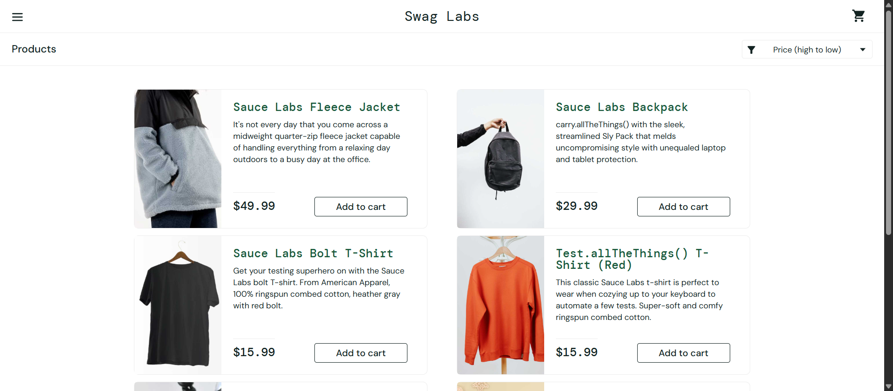
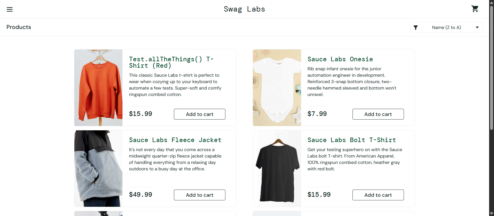
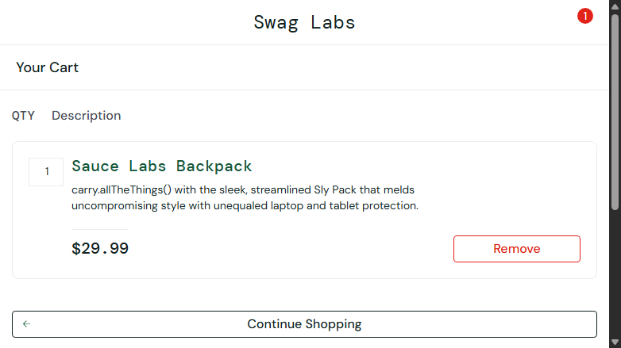
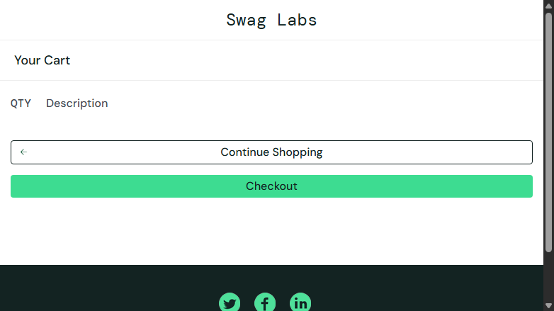
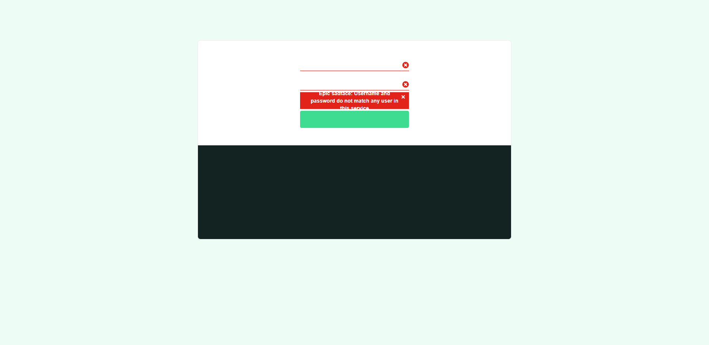
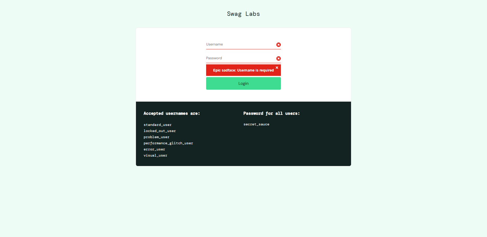

# Selenium Automation Learning

This project is a UI test automation framework built using Selenium WebDriver and TestNG to test the SauceDemo e-commerce application.

It follows the Page Object Model (POM) design pattern to ensure scalability, readability, and maintainability of test automation code.<br>


---
## 🚀 Overview

This project demonstrates a maintainable Selenium test framework with reusable page objects, TestNG data providers, explicit waits, screenshot capture, and ExtentReports output.

It currently covers:

- Login validation
- Inventory page checks
- Add to cart and remove from cart flows
- Product sorting checks
- Data-driven runs with multiple SauceDemo users
---
## 🛠 Tech Stack

- Java 21
- Maven
- Selenium WebDriver 4
- TestNG
- ExtentReports
- GitHub Actions (CI/CD)
- Apache Commons IO

---
##  🔥 Key Features
- Page Object Model (POM) architecture
- Data-driven testing using TestNG DataProvider
- Automated CI/CD pipeline (GitHub Actions)
- ExtentReports integration for test reporting
- Screenshot capture for test evidence
- Headless browser execution support

---
## 📁 Project Structure

```text
src/main/java/Pages/     Page objects
src/test/java/base/      WebDriver setup and teardown
src/test/java/tests/     TestNG test classes
src/test/java/utils/     Test data, reports, screenshots
screenshots/             Captured test evidence
testng.xml               Suite definition
pom.xml                  Maven build configuration
```
---
## 🧪 Test Coverage

- Valid login
- Invalid login
- Empty login submission
- Inventory page visibility
- Add item to cart
- Open cart and verify contents
- Remove item from cart
- Sort products A to Z
- Sort products Z to A
- Sort products by price low to high
- Sort products by price high to low
- Product count validation with multiple users

---
## Prerequisites

- Java 21
- Maven 3.9+
- Google Chrome installed
- Internet access for SauceDemo

---

##  ▶️ Running the Tests

Run the full suite:

```bash
mvn clean test
```

Run a single test class:

```bash
mvn -Dtest=LoginTests test
```

Run a single test method:

```bash
mvn -Dtest=LoginTests#invalidLoginTest test
```
---

## 📸 Screenshots
### Sorting (Price High to Low) <br>


### Sorting (Z-A) <br>


### Cart with Item <br>


### Cart After Removal <br>


### Invalid Login <br>


### Empty Login <br>


---

## 📊 Reporting

After execution, the framework generates:

- TestNG/Surefire output in `target/surefire-reports`
- ExtentReports HTML output in `test-output/ExtentReport.html`
- Screenshots in `screenshots/`

---

## Notes

- Tests use explicit waits in the page objects.
- WebDriver setup opens SauceDemo automatically before each test.
- Chrome runs in headless mode in the current test configuration.
- `Readme.md` is kept in the repo, but `README.md` is the file GitHub will render.

---
## 👨‍💻 Author

Deshanth Vishvalingam

