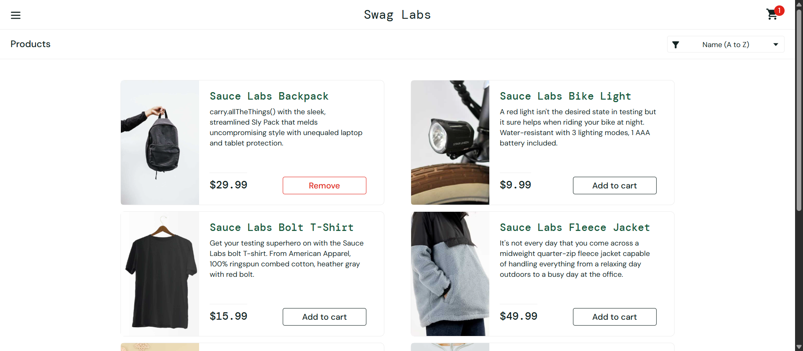
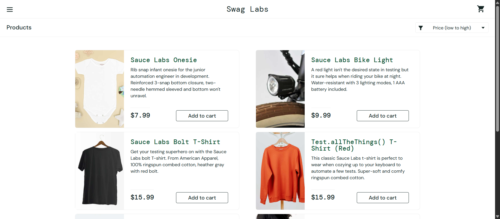

# 🧪 Selenium SauceDemo Automation Framework

## 📌 Project Overview
This project is a **UI test automation framework** built using **Selenium WebDriver and TestNG** to test the [SauceDemo](https://www.saucedemo.com/) e-commerce application.

It follows the **Page Object Model (POM)** design pattern to ensure **scalability, readability, and maintainability** of test automation code.

---

## 🛠 Tech Stack
- Java
- Selenium WebDriver
- TestNG
- Maven
- Page Object Model (POM)
- ExtentReports (for reporting)
- WebDriverWait (Explicit waits)

---

## ⚙️ Framework Features

- Page Object Model (POM) design pattern
- Maven-based project structure
- TestNG test framework
- Data-driven testing (TestNG DataProvider)
- Reusable utility methods for UI actions
- Explicit waits for handling dynamic elements
- Screenshot capture for test validation and debugging
- ExtentReports integration for detailed test reporting
- Automated cart workflow testing

---

## 📁 Project Structure

- `pages/` → Page Object Model classes (LoginPage, InventoryPage, CartPage)
- `tests/` → TestNG test cases
- `base/` → WebDriver setup and test configuration
- `utils/` → Utility classes (Screenshots, Data Providers, Reports)

---

## 🧪 Test Scenarios Covered

✔ Login with valid credentials  
✔ Login with invalid credentials  
✔ Login with empty credentials  
✔ Inventory page load validation  
✔ Add product to cart  
✔ Open cart validation  
✔ Remove product from cart  
✔ Cart empty validation  
✔ Product sorting validation (A–Z, Z–A, Price Low–High, High–Low)  
✔ Product count verification using multiple user data sets

---

## 🔄 Test Execution Flow

Login → Inventory → Add to Cart → Open Cart → Remove Item → Validate Result

---

## 📸 Screenshots

### Invalid Login Test


### Empty Login Test


### Add to Cart


### Cart with Product


### Empty Cart After Removal


### Price Low to High Sorting

---

## 🚀 How to Run This Project

### Prerequisites:
- Java installed
- Maven installed
- Chrome browser

### Steps:

```bash
git clone https://github.com/YOUR_USERNAME/YOUR_REPO.git
```
```bash
cd YOUR_REPO
```
```bash
mvn clean test
```

---
## 📊 Reports
- ExtentReports HTML report is generated after test execution
- Screenshots are attached for key test steps
- Helps in debugging failures and tracking execution flow
---

## 🎯 What I Learned
- Building automation frameworks using Selenium WebDriver
- Implementing Page Object Model (POM) architecture
- Writing maintainable and reusable test code
- Handling dynamic web elements using explicit waits
- Data-driven testing using TestNG
- Designing scalable QA automation frameworks

---

## 📂 GitHub Repository
https://github.com/YOUR_USERNAME/YOUR_REPO

---
## 👨‍💻 Author
Deshanth Vishvalingam <br>
QA Engineer | Test Automation Enthusiast | Web Development Freelancer